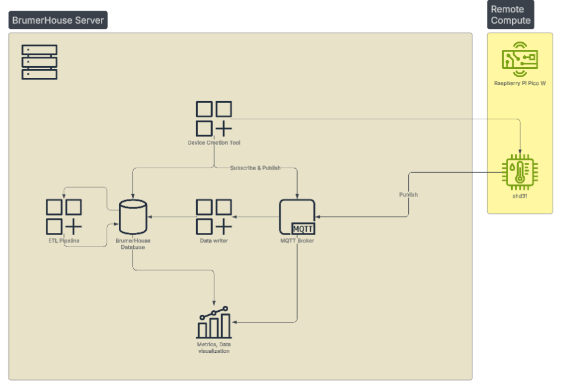
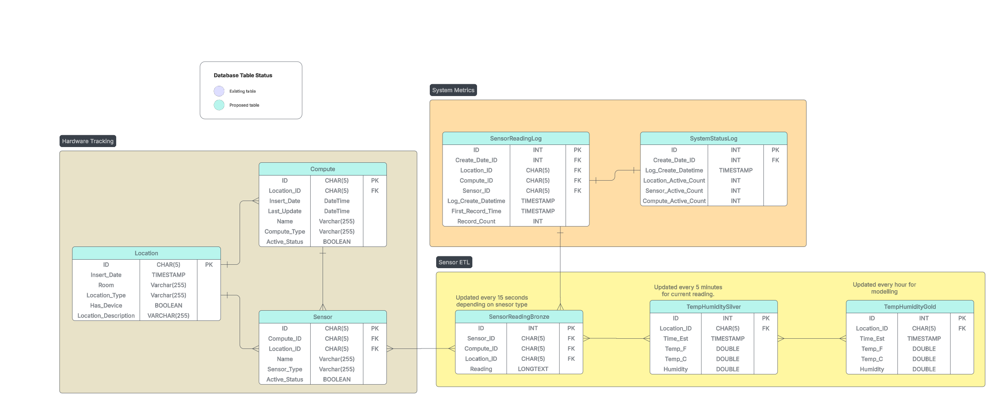

# BrumerHouse SmartHome

## Introduction

The movie, Smart Home was released in 1999. Although I have been waiting for 25 years, my apartment is still not like the house in this movie. Of course there are mass produced solutions to this problem. With a Google Home Mini and a couple smart lights, I could finally turn the lights off without getting out of bed. Add a TP-Link smart temperature sensor and I can be notified when it is time to close the windows and turn the A/C on (I could just wait until I feel warm but what’s the fun in that?). These can be a great solution as they are easy to set up and maintain. However, there are a number of drawbacks. First, if I control everything with a Home Mini, then Google has access to all that information. Second, the data can be difficult to capture and analyze. I would be relying on the device manufacturer to provide a API that allows me to access both streaming and historical data. Lastly, this method lacks the fun of building the system myself! This is the major contributor to me wanting to build my own smart home system.

## Project Requirements

As I begin this project, there are two broad requirements that I will keep in mind throughout the development process: reliability and scalability.

1.  Reliability: The system needs to work. I need to know that once it is up and running, it will continue to run unless I stop it.

2.  Scalability: The system needs to be able to adapt and grow as my needs do. To start, the system will be housed on a Raspberry Pi (hardware discussed below). However, it is only a matter of time before a single Raspberry Pi will not be sufficient. At that point, the system will need to be easily transferred to a new server. Additionally, this project will start with a few temperature sensors, but my goal is to add several different types of sensors, displays, lights, and more. The system needs to be designed so it can scale as the system becomes more complex.

The requirements will undoubtedly evolve and grow overtime. Down the line I will likely add requirements around security and efficiency; however, I am one person and need to start somewhere.

## System Design

{fig-alt="A high level system overview for the smart home system."}

Diagram one shows the system at a high level starting with a client creation tool and ending with a data dashboard. The items in the beige container will be hosted on a Raspberry Pi 4 server running Linux Ubuntu. Docker will be used to containerize the various services needed for the server to run (database, MQTT broker, etc.). The yellow container represents the client devices running on a Raspberry Pi Pico W.

The creation tool will be used to ensure that new clients follow a strict naming convention as well as run the same underlying code. At this time, the creation tool will be the only aspect of the system that allows user input. Initial versions of the dashboard may allow user input but will depend on the initial quality of the data. The system will also contain an MQTT broker to allow messaging between the clients and the server, a database for storing data, and an ETL pipeline for cleaning the data.

{fig-alt="A diagram of the dataase architecture for the smart home system."}

Diagram two displays the data architecture which is divided into three sections: hardware tracking, sensor ETL, and system metrics. This is only an initial diagram and the database is likely to grow overtime. The strict naming conventions designated by the creation tool will become extremely important as the number of tables in the database grows. Additionally, a data dictionary can be found in the Documentation folder of this project. Future posts will discuss the system and database in more detail.

## Roadmap

Below is a high level overview of the project's current next steps.

-   Develop a code that can be uploaded to a Raspberry Pi Pico W

-   Develop the device creation tool that generates the above code with ID's unique to the device

-   Develop the ETL process

-   Develop a front end dashboard